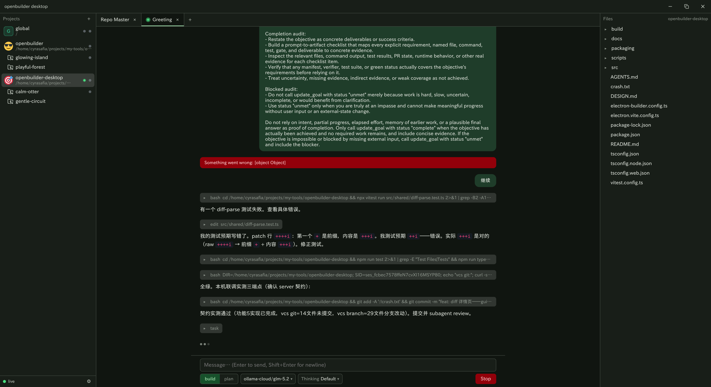

# openbuilder-desktop

> 面向所有 builder（而非仅 coder）的开源友好、跨平台 AI Agent 客户端。
> An open-source-friendly, cross-platform AI Agent client for **all builders** (not just coders).

[English](#english) · [中文](#中文)

---

## 中文

### 项目目标

openbuilder-desktop 的目标是创造一个**面向所有 builder（而非仅 coder）** 的开源友好的 opencode 桌面客户端。

它与移动端 openbuilder 同出一源：不绑定任何闭源商业服务，直连你自己的 opencode server，把 Agent 的对话、项目与工作区管理完整搬到桌面上。

当前版本仅对接 **opencode** 这一开源个人 Agent；未来与移动端一样，会逐步接入更多优秀的开源个人 Agent，让同一个客户端成为你与各类 Agent 协作的统一入口。

姊妹项目：[openbuilder](https://github.com/cyrasafia/openbuilder)（Flutter 移动端）。

### 功能简介



openbuilder-desktop 是 opencode server 的**瘦客户端**，renderer 通过 REST + SSE 直连服务端，无中间服务层。主要功能包括：

- **面向多任务设计**：通过 worktree、状态指示器指挥多个 agent 并行工作
- **固定式三栏布局**：左栏项目/worktree、中栏工作区、右栏文件树，支持文件拖放（WIP）
- **Everything is a tab**：会话、文件查看、diff、terminal（WIP）、浏览器（WIP）都是 tab，关闭 tab=归档

### 使用方法（构建）

#### 环境要求

- Node.js（开发环境为 26；包管理使用 npm，勿混用其他包管理器）
- 一台运行中的 opencode server（本机默认 `http://127.0.0.1:15120`，或远程地址）

#### 安装依赖与运行

```bash
# 拉取依赖
npm install

# 启动开发模式（GNOME/Wayland 下建议加 -- --disable-gpu 规避 Vulkan 崩溃）
npm run dev
```

首次启动后在设置弹窗中新建连接配置（profile）：填写 server URL 与凭据，连通后即可进入主界面；项目的打开/关闭、Tab 状态均按 profile 持久化于本地。

#### 代码质量

```bash
# 类型检查（node + web 双 tsconfig）
npm run typecheck

# 运行测试（vitest）
npm run test
```

#### 构建与打包

```bash
# 仅构建产物
npm run build

# Linux 安装包（electron-builder）
npm run package:linux

# 发行包：Arch（makepkg，产物 release/arch/*.pkg.tar.zst）
bash scripts/package-arch.sh

# 发行包：Fedora（fedora:41 容器内 rpmbuild）
bash scripts/package-fedora.sh
```

#### 通信层说明

本项目**不依赖 `@opencode-ai/sdk`**（npm 发布滞后于 server），通信层为自写的 REST + SSE 直连客户端，API 契约与移动端同源（`openbuilder/opencode_openapi.json`）。

---

## English

### Project Goal

openbuilder-desktop aims to create an **open-source-friendly desktop client for all builders — not just coders** — built on opencode.

It shares the same roots as the mobile app openbuilder: no lock-in to any closed commercial service. It connects directly to your own opencode server and brings agent conversations, project and workspace management to your desktop.

The current version only supports **opencode**, an open-source personal agent. As with the mobile version, we plan to integrate more great open-source personal agents over time, turning this single client into a unified entry point for collaborating with all kinds of agents.

Sister project: [openbuilder](https://github.com/cyrasafia/openbuilder) (Flutter mobile client).

### Features


openbuilder-desktop is a **thin client** for the opencode server: the renderer connects directly via REST + SSE, with no intermediate service layer. Key features:

- **Designed for multitasking**: orchestrate multiple agents working in parallel via worktrees and status indicators
- **Fixed three-pane layout**: projects/worktrees on the left, tab workspace in the middle, file tree on the right; file drag & drop (WIP)
- **Everything is a tab**: sessions, file viewing, diffs, terminal (WIP) and browser (WIP) are all tabs; closing a tab = archiving

### How to Build & Use

#### Requirements

- Node.js (developed on 26; use npm for package management — do not mix in other package managers)
- A running opencode server (local default `http://127.0.0.1:15120`, or a remote address)

#### Install dependencies & run

```bash
# Get dependencies
npm install

# Launch dev mode (on GNOME/Wayland, append -- --disable-gpu to avoid Vulkan crashes)
npm run dev
```

On first launch, create a connection profile in the settings dialog: enter the server URL and credentials. Once connected you'll enter the main interface; project open/close state and tab state are persisted locally per profile.

#### Code quality

```bash
# Typecheck (dual tsconfig: node + web)
npm run typecheck

# Run tests (vitest)
npm run test
```

#### Build & packaging

```bash
# Build artifacts only
npm run build

# Linux installer (electron-builder)
npm run package:linux

# Distribution package: Arch (makepkg, output release/arch/*.pkg.tar.zst)
bash scripts/package-arch.sh

# Distribution package: Fedora (rpmbuild inside a fedora:41 container)
bash scripts/package-fedora.sh
```

#### API client note

This project does **not depend on `@opencode-ai/sdk`** (npm releases lag behind the server). The communication layer is a hand-written REST + SSE client, sharing the same API contract as the mobile version (`openbuilder/opencode_openapi.json`).
