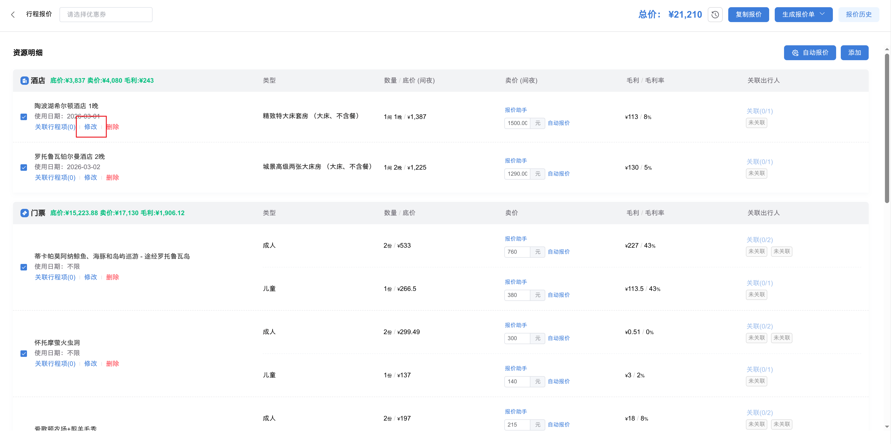
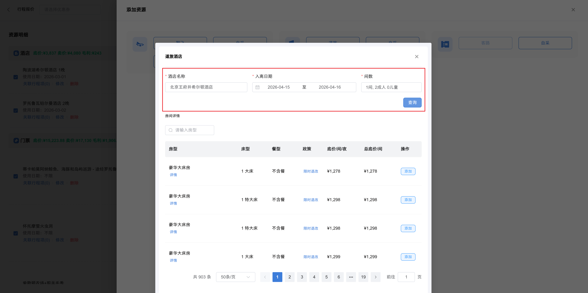

# 测试文档

这是一个用于验证发布能力的**标准测试文档**。  
本段为正文示例，包含*斜体*、**加粗**、以及***加粗斜体***混排。

## 二级标题示例
这里继续放正文内容，用于测试段落渲染、换行与空行表现。

### 多级无序列表示例

- 一级无序 A
  - 二级无序 A-1
    - 三级无序 A-1-1
  - 二级无序 A-2
- 一级无序 B
  - 二级无序 B-1

### 三级标题示例
这是一段普通文本，下面是一个超链接示例：  
[飞书开放平台](https://open.feishu.cn/)

这里补充行内代码示例：使用 `publish-to-feishu --dry-run "sample/测试文档.md"` 进行预检查。

#### 四级标题示例
下面展示无序列表：

- 列表项 A
- 列表项 B
- 列表项 C

##### 五级标题示例
下面展示有序列表：

1. 第一步：准备数据
2. 第二步：执行发布
3. 第三步：检查结果

### 多级有序列表示例

1. 一级有序 1
   1. 二级有序 1.1
      1. 三级有序 1.1.1
   2. 二级有序 1.2
2. 一级有序 2
   1. 二级有序 2.1

###### 六级标题示例
下面展示引用块：

> 这是引用内容示例。
> 引用可用于强调说明、备注或关键结论。
>
> 引用中的无序列表示例：
> - 引用项 A
> - 引用项 B
>
> 引用中的有序列表示例：
> 1. 引用步骤 1
> 2. 引用步骤 2
>
> 引用中的图片示例：
> 

## GitHub Alert（高亮块）示例

以下段落用于验证本地 `> [!TYPE]` 与飞书高亮块互转（发布为 callout，导出还原为 Alert）。

> [!NOTE]
> 这是一条 **NOTE**：用于补充说明或提示读者注意上下文。

> [!TIP] 带标题的提示
> 首行可写可选标题；正文支持列表：
> - Alert 内列表项甲
> - Alert 内列表项乙

> [!IMPORTANT]
> 关键信息：**IMPORTANT** 类型对应紫色系高亮。

> [!WARNING]
> 注意风险或需审慎操作时的 **WARNING** 示例。

> [!CAUTION]
> 可能产生负面后果时的 **CAUTION** 示例（偏红高亮）。

## 图片示例


## 表格示例

| 功能 | 状态 | 备注 |
| --- | --- | --- |
| 标题渲染 | 通过 | 支持 H1-H6 |
| 图片上传 | 通过 | 使用本地相对路径 |
| 链接渲染 | 通过 | 支持标准 Markdown 链接 |

## 代码块示例

```bash
# 设置默认发布路径为 Wiki 根目录
publish-to-feishu config --default-publish-path "wiki-root:7534543951832203267"

# 发布文档（走配置默认路径）
publish-to-feishu "sample/测试文档.md"
```

## 结尾
以上内容覆盖了常用 Markdown 格式：正文、各级标题、加粗、斜体、行内代码、代码块、图片、引用、**GitHub Alert（高亮块）**、表格、有序列表（含多级缩进）、无序列表（含多级缩进）、超链接。
<!-- feishu-doc-id: HXr7doKJmoAd0rx2rPuclqBonZg -->
